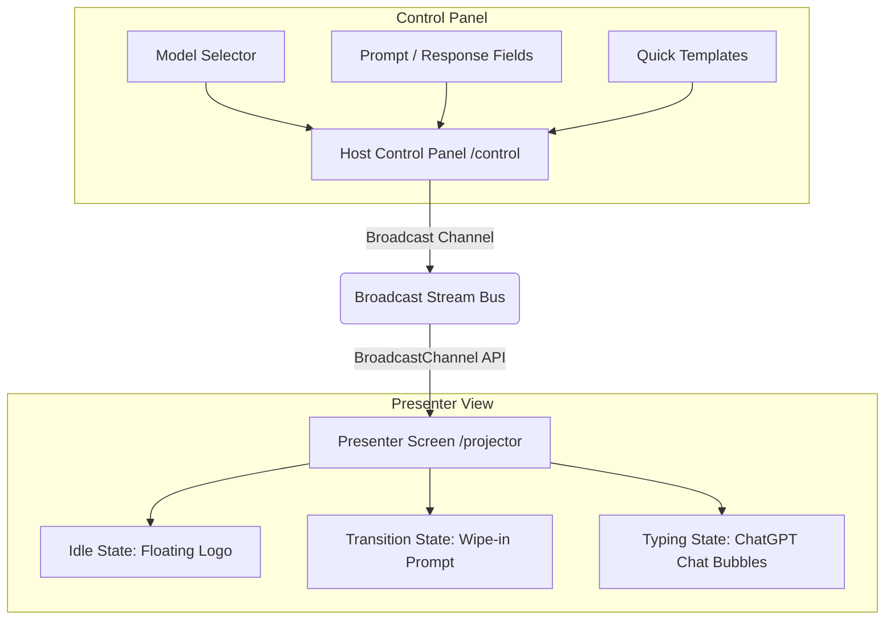

# Handoff Documentation — Pertu MI Ai

This document provides a comprehensive handover guide for developers or AI agents taking over the **Pertu MI Ai** codebase.

---

## 📋 Project Overview
**Pertu MI Ai** is a local-first, offline-ready browser sync system designed for live podcast producers. It enables near-zero latency (< 5ms) prompt and response synchronization between an operator’s control dashboard (`/control`) and a presenter's projector screen (`/projector`) using native browser APIs, completely client-side without any server backend.

---

## 🏗️ Architecture & Core Components

### 1. Synchronization Bus (`BroadcastChannel`)
- **Location:** [usePodcastChannel.ts](file:///Users/deakdavid/Documents/Portfolio/pertu-mi/src/hooks/usePodcastChannel.ts)
- **Mechanism:** Wraps the native HTML5 `BroadcastChannel` API under the room channel name `pertu_mi_production_stream`.
- **Typings:** Standardized in [index.ts](file:///Users/deakdavid/Documents/Portfolio/pertu-mi/src/types/index.ts):
  - `SystemState`: `"idle" | "transitioning" | "typing"`
  - `BroadcastPayload`: Includes `state`, `promptText`, `responseText`, `modelName`, and a synchronizing `timestamp`.

### 2. Operator Control Panel (`/control`)
- **Location:** [page.tsx](file:///Users/deakdavid/Documents/Portfolio/pertu-mi/src/app/control/page.tsx)
- **Features:**
  - Real-time animated state monitor tags syncing from the broadcast stream.
  - Form controls for typing custom prompts and responses.
  - **AI Model Selector**: Quick-choice buttons for `ChatGPT`, `Claude`, `Gemini`, or `Other` (which reveals a custom text input field).
  - **Quick Load Templates**: Load standard prompt/response mockups to test features immediately.

### 3. Presenter Screen Canvas (`/projector`)
- **Location:** [page.tsx](file:///Users/deakdavid/Documents/Portfolio/pertu-mi/src/app/projector/page.tsx)
- **Features:**
  - **Idle State**: Floating ambient logo loop with pulsing waiting message.
  - **Transitioning State**: Fast geometric clip-path entrance wipe to introduce the topic.
  - **Typing State**: ChatGPT-style layout with right-aligned prompt bubbles, left-aligned response containers, and model-specific circular brand avatars.
  - **Typewriter Effect**: Smooth character-by-character render with a neon amber blinking cursor.
  - **Fullscreen Toggle**: Floating corner glassmorphic button to trigger native browser fullscreen capability.

---

## 🎨 Styling & Layout Systems
- **Base Theme:** Deep Slate HSL palette configured in [globals.css](file:///Users/deakdavid/Documents/Portfolio/pertu-mi/src/app/globals.css).
- **Markdown Rendering:** Supports rich formatting inside transcripts using `react-markdown`. Custom inline elements prevent layout breakage and keep typewriter cursors directly attached to text streams.
- **Responsive Layout Design:**
  - Content wraps at `max-w-[90vw]` for comfortable large-screen reading from a 1.5m speaker distance.
  - Typography levels: Prompts scaled up to `text-5xl` (transitioning) and `text-3xl` (typing), responses scaled to `text-2xl` to `text-5xl`.

---

## ⚡ Recent Optimizations & Bug Fixes

1. **Seamless Presentation View & Shared Morphing**
   - Merged `transitioning` (prompt intro) and `typing` states under a single parent layout container (`key="session"`) inside the `<AnimatePresence>` tree. This keeps the prompt card mounted during state changes.
   - Added Framer Motion's physics-based spring `layout` prop to the prompt card `motion.div` to smoothly animate position, rounding, and padding shifts during state swaps.

2. **Crossfading Text Sizing & Stretching Prevention**
   - Separated the prompt card text into two distinct container divs (large-font intro and small-font minimized containers).
   - Animated their opacities and translation offsets (`opacity` and `y` offsets) to crossfade smoothly over 0.4 seconds.
   - Set the inactive container to `absolute` positioning, allowing the parent card bounding box to calculate height and width based solely on the active element.
   - Applied `layout="position"` to the inner content wrapper and the text container motion nodes. This forces Framer Motion to counter-scale nested content, completely resolving stretching and squashing distortion of letters while the card container resizes.
   - Removed conflicting CSS `transition-all duration-500` classes to prevent browser font reflow stutters.
   - Aligned card width constraints to a matching `w-full max-w-[85%]` in both states to preserve text wrap boundaries.

3. **Sequential Animation & Timer Offsets**
   - Shortened the control panel transition timer delay from `3500ms` to `3000ms` (3 seconds), causing the large text to fade out and morph 500ms earlier.
   - Introduced a `setTimeout` inside the projector's typewriter hook to delay printing by `500ms` after transitioning to the typing state.
   - This sequential timing ensures the prompt card completes its resize and morph to the top-right corner *before* typewriter typing commences, creating a much cleaner, less busy visual path.

4. **Static White ChatGPT SVG Asset**
   - Modified `public/chatgpt.svg` to include a `fill='#FFFFFF'` path attribute, ensuring the brand logo displays in clean high-contrast white on the dark presenter screen.

5. **Logo Corner Relocation & Overlap Prevention**
   - Active state brand logos are absolutely positioned in the upper-left corner (`absolute top-8 left-8 z-30`).
   - Content does not overlap or collide with branding graphics during presentation.

---

## 🛠️ Commands & Quality Checks
- `npm run dev` — Start the local development server.
- `npm run lint` — Perform code linting checks.
- `npx tsc --noEmit` — Run TypeScript type audits.
- `npm run build` — Compile Next.js production builds.

---

## 📈 Future Roadmaps & Recommendations
- **Background Throttling Optimization**: For dual-screen studio setups, remember to run macOS Chrome with native win-occlusion flags disabled (`chrome://flags/#calculate-native-win-occlusion`) so background tabs run at a smooth 60fps.
- **Audio Prompts**: Integrating native Web Speech Synthesizer features to read prompts aloud when state transitions occur.
