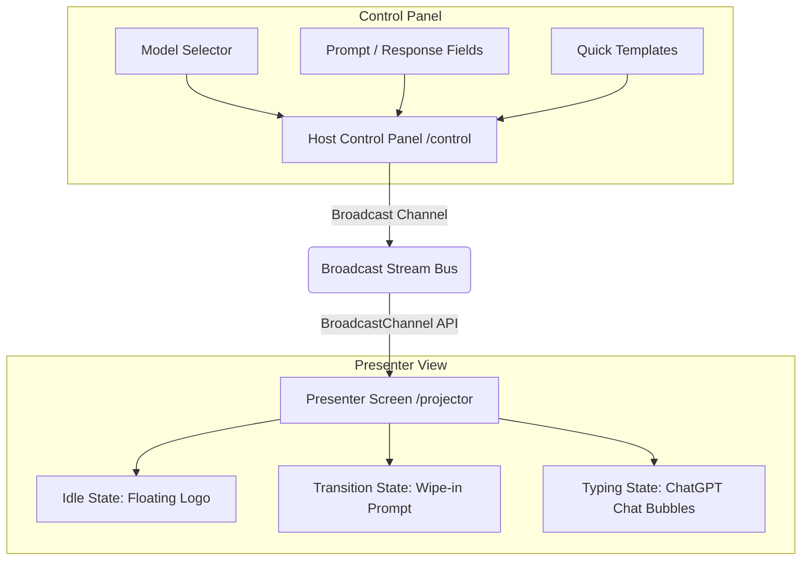

# Handoff Documentation — Pertu MI Ai

This document provides a comprehensive handover guide for developers or AI agents taking over the **Pertu MI Ai** codebase. It outlines the system architecture, code organization, layout mechanics, and the recently implemented typewriter timing and fullscreen toggle behaviors.

---

## 📋 Project Overview
**Pertu MI Ai** is a local-first, offline-ready browser sync system designed for live podcast producers. It enables near-zero latency (< 5ms) prompt and response synchronization between an operator’s control dashboard (`/control`) and a presenter's projector screen (`/projector`) using native browser APIs, completely client-side without any server backend.

---

## 🏗️ Architecture & Core Components

### 1. Synchronization Bus (`BroadcastChannel`)
- **Location:** [usePodcastChannel.ts](file:///Users/deakdavid/Documents/Portfolio/pertu-mi/src/hooks/usePodcastChannel.ts)
- **Mechanism:** Wraps the native HTML5 `BroadcastChannel` API under the room channel name `pertu_mi_production_stream`.
- **Typings:** Standardized in [index.ts](file:///Users/deakdavid/Documents/Portfolio/pertu-mi/src/types/index.ts):
  - `SystemState`: `"idle" | "transitioning" | "typing"`
  - `BroadcastPayload`: Includes `state`, `promptText`, `responseText`, `modelName`, and a synchronizing `timestamp`.

### 2. Operator Control Panel (`/control`)
- **Location:** [page.tsx](file:///Users/deakdavid/Documents/Portfolio/pertu-mi/src/app/control/page.tsx)
- **Features:**
  - Real-time animated state monitor tags syncing from the broadcast stream.
  - Form controls for typing custom prompts and responses.
  - **AI Model Selector**: Quick-choice buttons for `ChatGPT`, `Claude`, `Gemini`, or `Other` (which reveals a custom text input field).
  - **Quick Load Templates**: Load standard prompt/response mockups to test features immediately.

### 3. Presenter Screen Canvas (`/projector`)
- **Location:** [page.tsx](file:///Users/deakdavid/Documents/Portfolio/pertu-mi/src/app/projector/page.tsx)
- **Features:**
  - **Idle State**: Floating ambient logo loop with pulsing waiting message.
  - **Transitioning State**: Fast geometric clip-path entrance wipe to introduce the topic.
  - **Typing State**: ChatGPT-style layout with right-aligned prompt bubbles, left-aligned response containers, and model-specific circular brand avatars.
  - **Typewriter Effect**: Smooth character-by-character render with a neon amber blinking cursor.
  - **Fullscreen Toggle**: Floating corner glassmorphic button to trigger native browser fullscreen capability.

---

## 🎨 Styling & Layout Systems
- **Base Theme:** Deep Slate HSL palette configured in [globals.css](file:///Users/deakdavid/Documents/Portfolio/pertu-mi/src/app/globals.css).
- **Markdown Rendering:** Supports rich formatting inside transcripts using `react-markdown`. Custom inline elements prevent layout breakage and keep typewriter cursors directly attached to text streams.
- **Responsive Layout Design:**
  - Content wraps at `max-w-[90vw]` for comfortable large-screen reading from a 1.5m speaker distance.
  - Typography levels: Prompts scaled up to `text-5xl` (transitioning) and `text-3xl` (typing), responses scaled to `text-2xl` to `text-5xl`.

---

## ⚡ Recent Optimizations & Timing Upgrades

### 1. Paced Typewriter Response Writer
The typewriter response animation uses a **continuous linear acceleration curve** that mimics shifting gears (walking -> running -> riding a bike -> driving a car -> bullet train -> flying). This resolves the waiting time for long responses while ensuring that the start is readable and comfortable to read.

- **Initial legible pace:** Locks at exactly `1 character per tick` for the first `40 ticks` (~3.0 seconds) with a slow `90ms` initial delay.
- **Continuous acceleration:** Starting at tick 40, the step size increases gradually by `1 character every 60 ticks`:
  $$\text{charsToAdd} = \lfloor 1 + \frac{\text{ticks} - 40}{60} \rfloor$$
- **Delay decay:** The tick delay decreases slowly by `0.4ms` per tick, decaying from `90ms` down to a minimum of `15ms`.
- **Speed Phases:**
  - **🚶 Walking (ticks 0-60):** Delay 90ms down to 66ms, step = 1. (11 to 15 chars/sec)
  - **🏃 Running (ticks 60-100):** Delay 66ms down to 50ms, step = 1. (15 to 20 chars/sec)
  - **🚲 Riding a Bike (ticks 100-160):** Delay 50ms down to 26ms, step = 2. (40 to 76 chars/sec)
  - **🚗 Driving a Car (ticks 160-220):** Delay 26ms down to 15ms, step = 3. (115 to 200 chars/sec)
  - **🚄 Bullet Train (ticks 220-280):** Delay 15ms, step = 4. (266 chars/sec)
  - **✈️ Flying (ticks 280+):** Delay 15ms, step = 5+. (333+ chars/sec)
- **StrictMode Protection:** Built on a recursive `setTimeout` loop using local mutable length variables (`currentLength`, `ticks`) to ensure React StrictMode double-execution does not double typing speeds in development.

### 2. Auto-Hiding Fullscreen Button
- Modified the glassmorphic fullscreen toggle button on `/projector` to only render when the browser window is not in fullscreen mode (`!isFullscreen`).
- When the page enters fullscreen, the button disappears to clear visual clutter for broadcasting.
- Standard exits (e.g., pressing `Esc`) trigger the document `fullscreenchange` event handler, which updates states and makes the button reappear instantly.

### 3. Layout Morphing and Crossfades
- Shared layout morphing keeps the Prompt Card mounted during transition-to-typing state swaps, resizing it smoothly using Framer Motion springs.
- Integrated opacity and translation crossfades for card text container overlays to resolve letter distortion, line reflow snaps, and parent scale stretching.

---

## 🛠️ Commands & Quality Checks
- `npm run dev` — Start the local development server.
- `npm run lint` — Perform code linting checks.
- `npx tsc --noEmit` — Run TypeScript type audits.
- `npm run build` — Compile Next.js production builds.
