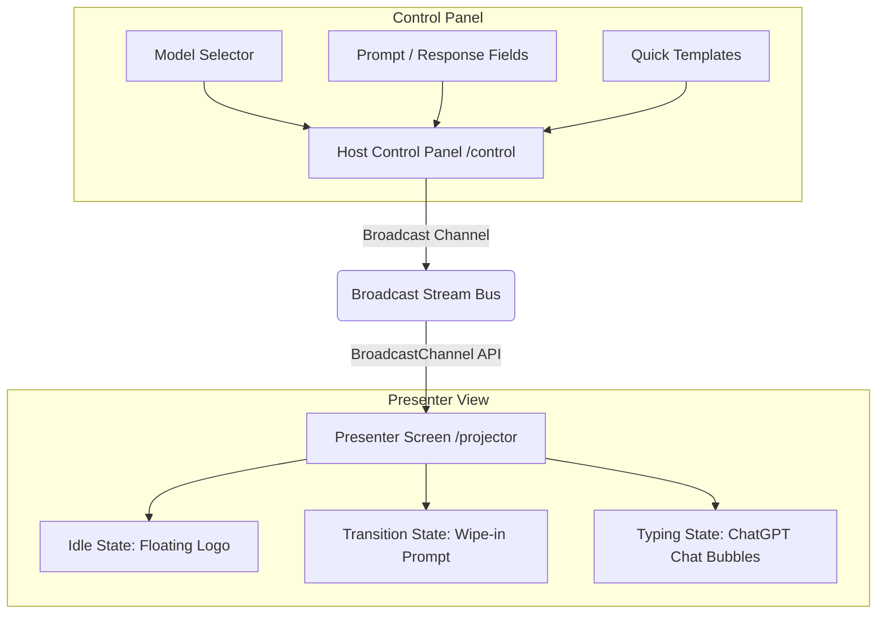

# Handoff Documentation — Pertu MI Ai

This document provides a comprehensive handover guide for developers or AI agents taking over the **Pertu MI Ai** codebase.

---

## 📋 Project Overview
**Pertu MI Ai** is a local-first, offline-ready browser sync system designed for live podcast producers. It enables near-zero latency (< 5ms) prompt and response synchronization between an operator’s control dashboard (`/control`) and a presenter's projector screen (`/projector`) using native browser APIs, completely client-side without any server backend.

---

## 🏗️ Architecture & Core Components

### 1. Synchronization Bus (`BroadcastChannel`)
- **Location:** [usePodcastChannel.ts](file:///Users/deakdavid/Documents/Portfolio/pertu-mi/src/hooks/usePodcastChannel.ts)
- **Mechanism:** Wraps the native HTML5 `BroadcastChannel` API under the room channel name `pertu_mi_production_stream`.
- **Typings:** Standardized in [index.ts](file:///Users/deakdavid/Documents/Portfolio/pertu-mi/src/types/index.ts):
  - `SystemState`: `"idle" | "transitioning" | "typing"`
  - `BroadcastPayload`: Includes `state`, `promptText`, `responseText`, `modelName`, and a synchronizing `timestamp`.

### 2. Operator Control Panel (`/control`)
- **Location:** [page.tsx](file:///Users/deakdavid/Documents/Portfolio/pertu-mi/src/app/control/page.tsx)
- **Features:**
  - Real-time animated state monitor tags syncing from the broadcast stream.
  - Form controls for typing custom prompts and responses.
  - **AI Model Selector**: Quick-choice buttons for `ChatGPT`, `Claude`, `Gemini`, or `Other` (which reveals a custom text input field).
  - **Quick Load Templates**: Load standard prompt/response mockups to test features immediately.

### 3. Presenter Screen Canvas (`/projector`)
- **Location:** [page.tsx](file:///Users/deakdavid/Documents/Portfolio/pertu-mi/src/app/projector/page.tsx)
- **Features:**
  - **Idle State**: Floating ambient logo loop with pulsing waiting message.
  - **Transitioning State**: Fast geometric clip-path entrance wipe to introduce the topic.
  - **Typing State**: ChatGPT-style layout with right-aligned prompt bubbles, left-aligned response containers, and model-specific circular brand avatars.
  - **Typewriter Effect**: Smooth character-by-character render with a neon amber blinking cursor.
  - **Fullscreen Toggle**: Floating corner glassmorphic button to trigger native browser fullscreen capability.

---

## 🎨 Styling & Layout Systems
- **Base Theme:** Deep Slate HSL palette configured in [globals.css](file:///Users/deakdavid/Documents/Portfolio/pertu-mi/src/app/globals.css).
- **Markdown Rendering:** Supports rich formatting inside transcripts using `react-markdown`. Custom inline elements prevent layout breakage and keep typewriter cursors directly attached to text streams.
- **Responsive Layout Design:**
  - Content wraps at `max-w-6xl` for comfortable large-screen reading from a 1.5m speaker distance.
  - Typography levels: Prompts scaled to `text-2xl md:text-3xl`, responses scaled to `text-xl sm:text-2xl md:text-3xl lg:text-4xl`.

---

## ⚡ Recent Optimizations & Bug Fixes

1. **Logo Corner Relocation & Overlap Prevention**
   - Active state brand logos are absolutely positioned in the upper-left corner (`absolute top-8 left-8 z-30`).
   - Content does not overlap or collide with branding graphics during presentation.
2. **Clipping & Height Fixes**
   - Removed screen height restriction (`overflow-hidden`) on the outer canvas page wrapper.
   - Swapped `.projector-canvas` CSS rules to `overflow-y: auto` with hidden scrollbar styles.
   - Wrapped active components inside a centering wrapper (`min-h-full py-24 px-6 md:px-12`) ensuring shorter pages center vertically while longer templates scroll comfortably.
3. **Stable Character-Slicing Typewriter**
   - Slices direct indices (`payload.responseText.slice(0, typedLength)`) instead of string accumulators, preventing eaten first letters on channel updates.
4. **Static AI Brand Logos**
   - Integrated custom static SVG/PNG files located under the `public/` directory:
     - ChatGPT Logo: `/chatgpt.svg`
     - Claude Logo: `/claude.svg`
     - Gemini Logo: `/gemini.png`

---

## 🛠️ Commands & Quality Checks
- `npm run dev` — Start the local development server.
- `npm run lint` — Perform code linting checks (passes with 0 errors).
- `npx tsc --noEmit` — Run TypeScript type audits (compiles with 0 errors).
- `npm run build` — Compile Next.js production builds (succeeds successfully).

---

## 📈 Future Roadmaps & Recommendations
- **Background Throttling Optimization**: For dual-screen studio setups, remember to run macOS Chrome with native win-occlusion flags disabled (`chrome://flags/#calculate-native-win-occlusion`) so background tabs run at a smooth 60fps.
- **Audio Prompts**: Integrating native Web Speech Synthesizer features to read prompts aloud when state transitions occur.
