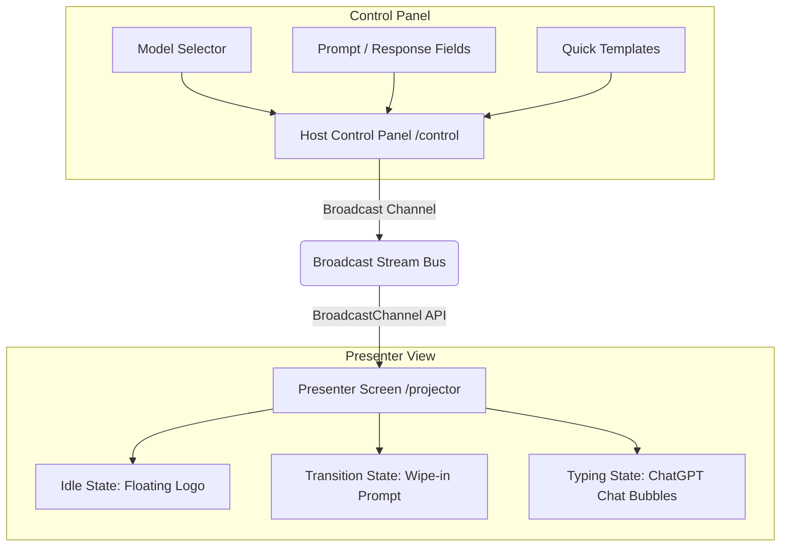

# Handoff Documentation — Pertu MI Ai

This document provides a comprehensive handover guide for developers or AI agents taking over the **Pertu MI Ai** codebase. It outlines the system architecture, code organization, layout mechanics, typewriter pacing, and recent structural formatting/cursor overrides.

---

## 📋 Project Overview

**Pertu MI Ai** is a local-first, offline-ready browser sync system designed for live podcast producers. It enables near-zero latency (< 5ms) prompt and response synchronization between an operator’s control dashboard (`/control`) and a presenter's projector screen (`/projector`) using native browser APIs, completely client-side without any server backend.

---

## 🏗️ Architecture & Core Components

### 1. Synchronization Bus (`BroadcastChannel`)

- **Location:** [usePodcastChannel.ts](file:///Users/deakdavid/Documents/Portfolio/pertu-mi/src/hooks/usePodcastChannel.ts)
- **Mechanism:** Wraps the native HTML5 `BroadcastChannel` API under the room channel name `pertu_mi_production_stream`.
- **Typings:** Standardized in [index.ts](file:///Users/deakdavid/Documents/Portfolio/pertu-mi/src/types/index.ts):
  - `SystemState`: `"idle" | "transitioning" | "typing"`
  - `BroadcastPayload`: Includes `state`, `promptText`, `responseText`, `modelName`, and a synchronizing `timestamp`.

### 2. Operator Control Panel (`/control`)

- **Location:** [page.tsx](file:///Users/deakdavid/Documents/Portfolio/pertu-mi/src/app/control/page.tsx)
- **Features:**
  - Real-time animated state monitor tags syncing from the broadcast stream.
  - Form controls for typing custom prompts and responses.
  - **AI Model Selector**: Quick-choice buttons for `ChatGPT`, `Claude`, `Gemini`, or `Other` (custom text input).
  - **Sanitized Outputs**: Cleans up text on broadcast to filter out whitespace-only rows, trim strings, collapse internal multiple spaces, and preserve a single structural blank line (`\n\n`) between blocks.

### 3. Presenter Screen Canvas (`/projector`)

- **Location:** [page.tsx](file:///Users/deakdavid/Documents/Portfolio/pertu-mi/src/app/projector/page.tsx)
- **Features:**
  - **Idle State**: Floating ambient logo loop with pulsing waiting message.
  - **Transitioning State**: Fast geometric clip-path entrance wipe to introduce the topic.
  - **Typing State**: ChatGPT-style layout with right-aligned prompt bubbles, left-aligned response containers, and model-specific circular brand avatars.
  - **Typewriter Effect**: Smooth character-by-character render with a custom blinking cursor.
  - **Fullscreen Toggle**: Floating corner glassmorphic button to trigger native browser fullscreen capability.

---

## 🎨 Styling, Layout & Block Formatting

### 1. Paragraph Block separations

To prevent distinct paragraphs and lists from merging together on the same line (lazy list continuation parsing), paragraphs are rendered as standard block-level `
` elements:

- In [globals.css](file:///Users/deakdavid/Documents/Portfolio/pertu-mi/src/app/globals.css), styled paragraphs `.markdown-content p` with a compact bottom margin (`margin-bottom: 0.25em`) and text newline support (`white-space: pre-line`).
- Added `.markdown-content { white-space: normal; }` to collapse layout formatting newlines in the DOM, guaranteeing that the block-separating `\n\n` empty line does not render as an actual empty row on the screen.

### 2. Markdown List Tightening

In [globals.css](file:///Users/deakdavid/Documents/Portfolio/pertu-mi/src/app/globals.css):

- Reduced list (`ul`, `ol`) margin to `0.2em 0` and padding-left to `1.2em`.
- Set `white-space: normal` on `ul`, `ol`, and `li` tags to ignore formatting newlines inside lists.
- Reduced bottom margin on list items (`li`) to `0.12em` for tight spacing.

---

## ⚡ Timing, Transitions & Cursor Overrides

### 1. Paced Typewriter Response Writer

The typewriter response animation uses a **continuous linear acceleration curve** that mimics shifting gears (walking -> running -> riding a bike -> driving a car -> bullet train -> flying). This resolves the waiting time for long responses while ensuring that the start is readable and comfortable to read.

- **Initial legible pace:** Locks at exactly `1 character per tick` for the first `40 ticks` (~3.0 seconds) with a slow `90ms` initial delay.
- **Continuous acceleration:** Starting at tick 40, the step size increases gradually by `1 character every 60 ticks`:
  $$\text{charsToAdd} = \lfloor 1 + \frac{\text{ticks} - 40}{60} \rfloor$$
- **Delay decay:** The tick delay decreases slowly by `0.4ms` per tick, decaying from `90ms` down to a minimum of `15ms`.
- **StrictMode Protection:** Built on a recursive `setTimeout` loop using local mutable length variables (`currentLength`, `ticks`) to ensure React StrictMode double-execution does not double typing speeds in development.

### 2. Recursive React Tree Cursor Injection

Instead of appending the typewriter cursor after the markdown rendering component, we dynamically inject the blinking cursor _directly_ inside the text:

- When typing is active, we append a `[CURSOR]` token to the end of the text slice.
- Inside [projector/page.tsx](file:///Users/deakdavid/Documents/Portfolio/pertu-mi/src/app/projector/page.tsx), `injectCursor(children, isTypingComplete)` recursively walks the React virtual DOM child nodes. If it finds the `[CURSOR]` string token, it replaces it inline with a keyed `<React.Fragment key="typewriter-cursor-fragment">` wrapping the styled ``.
- This ensures the cursor blinks inline inside the active paragraph or list item, and disappears cleanly when typing is complete.

### 3. Auto-Hiding Fullscreen Button

- Modified the glassmorphic fullscreen toggle button on `/projector` to only render when the browser window is not in fullscreen mode (`!isFullscreen`).
- Standard exits (e.g., pressing `Esc`) trigger the document `fullscreenchange` event handler, which updates states and makes the button reappear instantly.

---

## 🛠️ Commands & Quality Checks

- `npm run dev` — Start the local development server.
- `npm run lint` — Perform code linting checks.
- `npx tsc --noEmit` — Run TypeScript type audits.
- `npm run build` — Compile Next.js production builds.

# Next session fix needed

- Please fix the typewriter effect on the `/projector` page. The effect currently does not display: previously, a vertical line appeared before the text and blinked at the end as characters were typed. Now nothing shows up.
